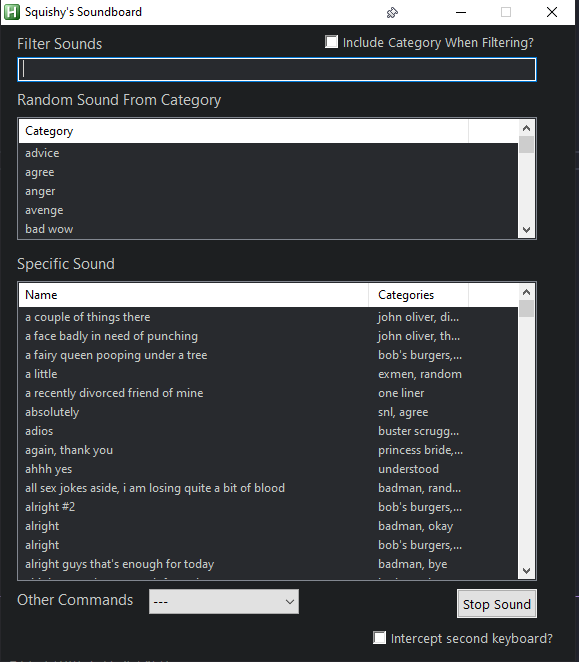
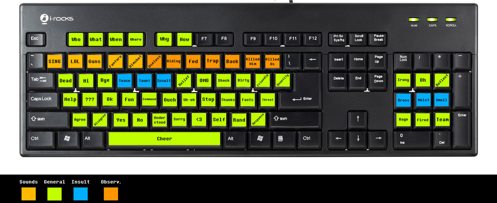
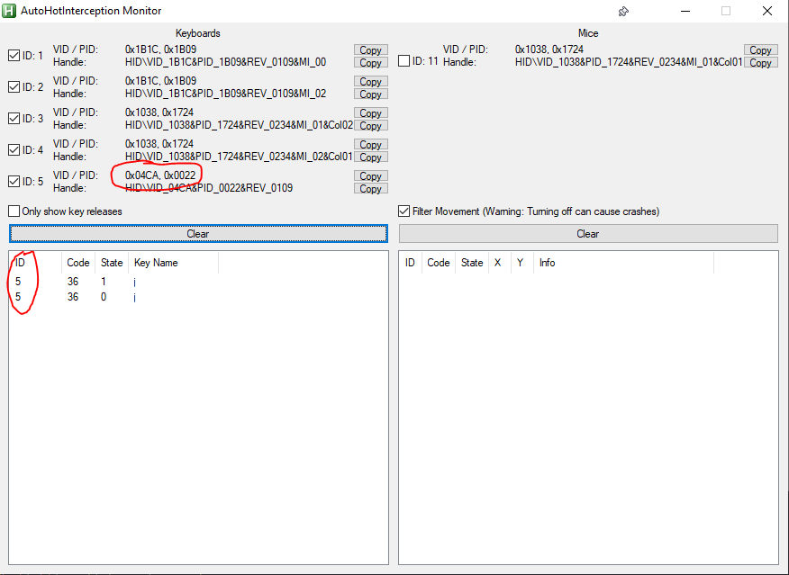

# Squishy's Soundboard

## What is this?
After trying several other soundboard tools available for download, I was never quite satisfied.  

- I wanted a tool that would make it easy to play specific sounds from a library of hundreds of sounds.  
- I wanted the ability to play a random sound from a category, such as a random compliment or hello.
- I wanted to do this without having to bind a series of keybinds or set up a second keyboard.
- I wanted to be able to quickly add and reorganize my sounds without having to update the script itself.

I found a tool by [Asger Juul Brunshøj](https://github.com/plul/Public-AutoHotKey-Scripts) that uses a GUI to allow you to run [AutoHotKey](https://www.autohotkey.com) macros via text commands.  I've adjusted the script quite a bit to fit my needs, and what we have now is Squishy's Soundboard!



## How it works
This repo has a `/sounds` folder with a couple of sounds to get you started.  The script scans filenames in order to generate a list of categories and individual sounds, which are then populated into the interface.

## Update script with your paths

In order for the script to work, you will need to make a couple of changes specific to your setup.

### Determine your `vlc_audio_out` value

1) Run VLC Media Player.

2) Go to **Tools -> Preferences**.

3) Click on the **Audio** tab.  **Click this tab first or else you won't get a list of sound devices!**

4) Under *Show settings* section at the bottom left of the window, choose **All**.

5) Under the *Audio* category on the left, expand **Output Modules** and select **WaveOut**.

6) Under the *Select Audio Device* dropdown box, look for *CABLE Output*, or whichever sound device you set as Hardware Input 2 in Voicemeeter. You need to copy **EXACTLY** what it shows in the dropdown box. Write or type down exactly what is in here.

### Update the `user-settings.ahk` file

1) In the folder where you saved the soundboard repository, open *user-settings.ahk* in a text editor.

2) Search the file for the below line.  Replace the portion in double quotes after the equal sign with the device name you wrote down in Step 6.

`global vlc_audio_out := ""`

3) You may also have to change this line to point to your VLC executable if the path differs.

`global vlc_path := "C:\Program Files\VideoLAN\VLC\vlc.exe"`

4) Save the script.

## Using the script
The base requirements to use the script require installation of both [AutoHotKey](https://www.autohotkey.com) and [VLC Media Player](https://www.videolan.org/).  If you want others to hear your sounds when you play them, you will have to configure some additional software.  [I wrote an article detailing how to do this that you should check out!](https://joshpayette.dev/posts/create-your-own-soundboard)

To start using the script, double-click `SquishySoundboard.ahk` in the main folder.  Once the script is running, you can press `CapsLock + Spacebar` to minimize/maximize the gui, making it quick to swap to/from a game or other window.

**Note: By default, Caps Lock will not work while the script is working.  You can press `Alt + CapsLock` to toggle it on and off.**

## Using the soundboard GUI
Use the textbox above each list to filter the items in the list.  You can either double-click an item in the list, or press `Enter` in the textbox to play the sound.

When pressing enter in the filter textfield, the script will first check if there is one remaining category listed.  If so, it will play a random sound from that category.  If not, the script will then check if there is one remaining individual sound listed.  If so, it will play that.

## Adding sounds
When I made this script, I wanted it to be very easy to add and organize your sounds without needing to do anything with the script.  In the project root, there is a sounds folder.  All mp3 files you add to this folder will automatically be brought into the script as soon as you reload the script.

### Naming the sounds
Your file name should generally follow this structure: `search terms for file [category1, category2].mp3.`  The script will check each file name and take the comma-separated category names from with the `[]` square brackets.  The individual file names list is everything in the file name not enclosed in the square brackets.

I find it works best to use as many of the words from the sound file in the file name, making it easy to filter down and get to the exact file you want.  You can add as many categories as you want, allowing this file to be included if you randomly play a certain category.

### Creating sounds
If you are looking to rip your own sounds from videos or other sound sources, you will want to [check out this article I wrote](https://joshpayette.dev/posts/create-your-own-soundboard) on setting up a virtual audio cable to play the sounds through your mic input, as well as tools to equalize the volume of the sounds and rip your own.

## Using a second keyboard

The below steps are optional.  You only need to do anything detailed below if you want to use a second keyboard to trigger random sounds. 



### Required installs

Getting AHK to intercept keystrokes from a second keyboard, but not pass those keystrokes to Windows, requires the installation of a couple of tools, as well as some additional updates to the main `SquishySoundboard.ahk` script.

#### Interception Driver
In order to get a second keyboard working, you will need to install the [AHK Interception Driver 1.0.1](https://github.com/oblitum/interception/releases/tag/v1.0.1). Installation requires specific steps that I will detail below.  Do not just double-click files in the download or it won't work!

1) Download the [AHK Interception Driver 1.0.1](https://github.com/oblitum/interception/releases/tag/v1.0.1) and then open the file.  Extract the `Interception` folder to your Desktop or other convenient location.

2) Run command prompt as administrator.

3) Browse to the `Interception` folder you extracted, then into the `command line installer` folder.

4) Type `install-interception.exe /install`.

5) Reboot after the install.


#### AutoHotKey Interception (AHI) configuration

The AHI tool makes the Interception driver available in our AHK script to use.  This allows us to actually capture the keystrokes and act upon them!

1) Browse to your Soundboard folder, then into the `scripts\AHI\Lib` folder.

2) Right-click on `Unblocker.ps1`, then click `Run With Powershell`.  This is because downloaded DLLs are often blocked and will not work.  This can be done manually by right clicking the DLLs, selecting Properties, and checking a "Block" box if it exists.

### Determine `keyboard_vid` and `keyboard_pid` values

Every keyboard has a unique VID and PID, and this will allow our script to target and intercept the correct keyboard.

1) Plug in your second keyboard.

2) Browse to your Soundboard folder, then run `scripts\AHI\Monitor.ahk`.

3) Check the boxes next to all Keyboards, then press a key on your second keyboard.  The output portion of the window will show the ID of the device.  Look to the corresponding keyboard with that ID, and then jot down the VID and PID.  In the example below, our VID is `0x04CA` and the PID is `0x0022`.



4) Open `SquishySoundboard.ahk`, then update the below lines with your own values.

```
global keyboard_vid = 0x04CA
global keyboard_pid = 0x0022
```

### Configure your keymap

Once everything is set up, you will need to update the keymap object in `SquishySoundboard.ahk` with your own preferences.  I have added comments to help you understand which property corresponds to which keystroke.  You can ignore the `spacer: ""` property, as that is just there to make reading easier.

**Example**
```
global keymap := { spacer: ""
; Key: 1
, 2: ["hello", "bye"]
; Key 2
, 3: ["insult"]}
```

### That's it!

With all of that done, pressing a key on your second keyboard sdhoulpd play a random sound from one of the categories you listed in the keymap!